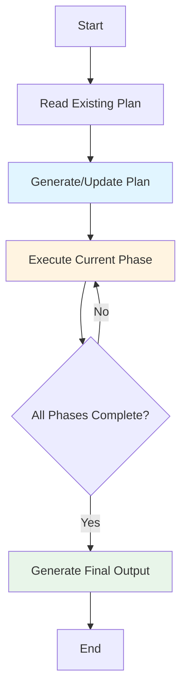

# Manus Agent Example

This example demonstrates the **Manus-style planning agent** that combines the power of LangGraphGo's graph execution with persistent Markdown file planning.

## Background: From Manus AI to planning-with-files

### The Success Story of Manus AI

[Manus AI](https://www.manus.ai) is a company acquired by Meta in December 2025 for **$2 billion**. In just 8 months, Manus went from launch to $100M+ revenue. Their secret? **Context Engineering**.

> "Markdown is my 'working memory' on disk. Since I process information iteratively and my active context has limits, Markdown files serve as scratch pads for notes, checkpoints for progress, building blocks for final deliverables."
> — [Manus AI](https://manus.im/blog/Context-Engineering-for-AI-Agents-Lessons-from-Building-Manus)

### planning-with-files: Reverse-Engineered Open Source Implementation

[planning-with-files](https://github.com/OthmanAdi/planning-with-files) is an open-source project created by independent developer Ahmad Othman, who **reverse-engineered** Manus AI's core workflow pattern.

**The Story:**

1. **Reddit Post Goes Viral** - Ahmad published a [detailed analysis](https://www.reddit.com/r/ClaudeAI/comments/1q2p03x/i_reverseengineered_the_workflow_that_made_manus/) on Reddit, explaining how Manus breaks through AI context limits using the 3-file pattern. The post gained massive attention within 24 hours, with the project quickly gaining 3.4k+ stars in just one week.

2. **Trade Secret Becomes Open Source** - planning-with-files turned what was originally a trade-secret workflow into an open-source Claude Code skill, allowing anyone to use the same technique.

3. **Ported to Go** - This example ports the same core pattern to LangGraphGo, enabling Go developers to build AI applications with powerful planning capabilities.

### How This Example Relates to planning-with-files

| Feature | planning-with-files | LangGraphGo Manus Agent |
|---------|---------------------|-------------------------|
| **Platform** | Claude Code Skill | Go Library |
| **Integration** | Claude Code Plugin | Programmable API |
| **Use Case** | Assist with Claude coding | Build Go AI applications |
| **Control Level** | High-level abstraction | Fully customizable |

Both implement the **same core pattern**, but serve different use cases:
- Use **planning-with-files** if you want Claude Code to help you code
- Use **LangGraphGo Manus Agent** if you want to build your own AI applications in Go

## What is Manus Agent?

The Manus Agent implements Manus AI's core workflow pattern, using three persistent Markdown files to manage complex tasks:

- **task_plan.md** - Track workflow phases with checkboxes
- **notes.md** - Store research findings and error logs
- **output.md** - Generate final deliverable

### The 3-File Pattern

Manus's core workflow uses three persistent Markdown files:

```
task_plan.md      → Track phases and progress
notes.md          → Store research and findings
[deliverable].md  → Final output
```

### The Loop

```
1. Create task_plan.md with goal and phases
2. Research → save to notes.md → update task_plan.md
3. Read notes.md → create deliverable → update task_plan.md
4. Deliver final output
```

**Key insight:** By reading `task_plan.md` before each decision, goals stay in the attention window. This is how Manus handles ~50 tool calls without losing track.

## Key Features

This implementation inherits the core strengths of the Manus workflow:

✅ **Persistent Planning** - Plans aren't just in memory — they're saved to Markdown files that you can review and track anytime

✅ **Automatic Checkpoints** - Progress is saved after each phase, so you can resume from where you left off without worrying about interruptions

✅ **Error Logging** - Errors aren't lost — everything gets automatically logged to notes.md for later analysis

✅ **Human-Editable** - Don't like a phase? Just edit task_plan.md to adjust the workflow, no code changes needed

✅ **Visual Progress** - Checkboxes make it crystal clear what's done and what's pending

## How It Works



## Prerequisites

- Go 1.21 or higher
- OpenAI API key (set via `OPENAI_API_KEY` environment variable)

## Installation

```bash
cd examples/manus_agent
go mod tidy
```

## Running the Example

### Basic Usage

```bash
# Set your OpenAI API key
export OPENAI_API_KEY="your-api-key-here"

# Optional: Set custom model or API base
export OPENAI_MODEL="gpt-4"
export OPENAI_API_BASE="https://api.openai.com/v1"

# Run the example
go run main.go
```

### What You'll See

Running the example shows the Manus Agent in action. It will:

1. **Create a work directory** (`./manus_work/`) - All files are organized here
2. **Generate a plan** in `task_plan.md` with checkboxes - Watch the plan get created
3. **Execute each phase** (research → compile → write → review) - Each phase runs sequentially
4. **Update checkboxes** as phases complete - Visual progress tracking in action
5. **Log findings** to `notes.md` - Research gets saved along the way
6. **Generate final output** in `output.md` - Your final deliverable

### Example Output

```
🚀 Manus Agent Example
=====================

Task: Research TypeScript benefits and write a summary

⏳ Executing Manus Agent...

🔍 Phase: Research
   - Searching for TypeScript documentation
   - Analyzing community feedback
   - Gathering statistical data

📝 Phase: Compile Findings
   - Organizing research data
   - Extracting key points
   - Creating structured notes

✍️  Phase: Write Summary
   - Drafting introduction
   - Writing body sections
   - Creating conclusion

✅ Phase: Review
   - Checking factual accuracy
   - Validating structure
   - Quality assessment

✅ Execution completed!
⏱️  Total time: 2.1s

📁 Generated Files:
==================

📄 task_plan.md:
---------------
%% Goal
Research and document the benefits of TypeScript for development teams

%% Phases
- [x] Phase 1: Research
  Description: Search for and gather information from external sources
  Node: research

- [x] Phase 2: Compile Findings
  Description: Compile findings into organized notes
  Node: compile

- [x] Phase 3: Write Summary
  Description: Write final deliverable based on research
  Node: write

- [x] Phase 4: Review
  Description: Review and validate the output
  Node: review

📋 output.md:
-----------
# Final Output

Generated at: 2025-01-07 15:30:45

[Full deliverable content...]

💡 Tip: Edit task_plan.md to adjust the workflow and re-run!
```

## Generated Files

### task_plan.md

Contains the workflow plan with progress checkboxes:

```markdown
%% Goal
Research and document the benefits of TypeScript for development teams

%% Phases
- [x] Phase 1: Research
  Description: Search for and gather information
  Node: research

- [ ] Phase 2: Compile
  Description: Compile findings into notes
  Node: compile
```

### notes.md

Contains research findings and error logs:

```markdown
## Research Notes

### TypeScript Benefits
- Type safety prevents runtime errors
- Better IDE support
- ...

## Error Log
[Any errors encountered during execution]
```

### output.md

Contains the final deliverable generated by the agent.

## Customization

### Adding Custom Phases

Edit the `nodes` slice in `main.go`:

```go
nodes := []graph.TypedNode[map[string]any]{
    {
        Name:        "my_custom_phase",
        Description: "Description of what this phase does",
        Function:    myCustomNodeFunc,
    },
    // ... more nodes
}
```

### Changing File Paths

Modify the `config`:

```go
config := prebuilt.ManusConfig{
    WorkDir:    "./my_work",
    PlanPath:   "./my_work/my_plan.md",
    NotesPath:  "./my_work/my_notes.md",
    OutputPath: "./my_work/my_output.md",
    AutoSave:   true,
    Verbose:    true,
}
```

### Human-in-the-Loop

Enable manual intervention between phases:

```go
agent.InterruptBefore([]string{"planner"})
```

Then edit `task_plan.md` while paused, and the agent will read the updated plan on resume.

## Use Cases

Manus Agent shines with tasks that benefit from a structured, phased approach. Here are some typical scenarios:

✅ **Multi-step Research** - Academic research or market analysis where you gather data, synthesize findings, then write up results

✅ **Documentation Projects** - API docs and user guides work well when organized section by section

✅ **Content Creation** - Writing articles, reports, or whitepapers is easier with an outline-first approach

✅ **Data Processing** - ETL workflows and data pipelines where each step can be validated independently

✅ **Complex Workflows** - Any task with 3+ sequential steps — the more steps, the more valuable it becomes

## Comparison: Manus Agent vs Planning Agent

LangGraphGo also has a `CreatePlanningAgent` — how does it compare to Manus Agent?

| Feature | CreatePlanningAgent | CreateManusAgent |
|---------|---------------------|------------------|
| Planning Format | JSON | Markdown |
| Progress Tracking | Message history | Checkboxes |
| Persistence | State only | Files + State |
| Human Editing | Via UpdateState() | Edit files directly |
| Best For | Quick automation | Complex multi-step tasks |

**The bottom line:** If your task is straightforward and you want to get it done quickly, `CreatePlanningAgent` works well. But for complex tasks that need human intervention or visual progress tracking, `CreateManusAgent` is the better choice.

## Advanced Usage

### Resume from Checkpoint

No special configuration needed — the agent automatically reads `task_plan.md` and continues from pending phases:

```go
result, err := agent.Invoke(ctx, initialState)
```

### Error Recovery

Don't worry when errors happen — everything gets automatically logged to `notes.md`:

```markdown
## Error [2025-01-07 15:30:45]
Error in phase 2 (compile): connection timeout
```

Fix the issue and rerun. The agent will continue from the failed phase without repeating completed work.

### Dynamic Planning

The LLM generates plans based on your specific request. Different goals produce different plan structures:

```go
// Request 1: "Research TypeScript benefits"
// → Plan: research → compile → write → review
// Four phases, comprehensive approach

// Request 2: "Quick TypeScript summary"
// → Plan: research → write
// Just two phases, faster results
```

## Troubleshooting

Running into issues? Here are some common problems and how to debug them:

### Agent doesn't create files

First, check that the `workDir` path is correct — watch out for relative paths depending on where you run from. Then make sure you have write permissions, and finally verify that `AutoSave: true` is set in your config.

### Plan generation fails

This is usually related to the LLM. Check that your `OPENAI_API_KEY` is set correctly. If you're using GPT-4, try switching to `gpt-3.5-turbo` — it's cheaper and faster. Also make sure your node descriptions are clear; if they're too vague, the LLM might not know how to use them.

### Phases don't complete

Check that your node functions return the right state. The state must include a `messages` field. If you're still stuck, look at `notes.md` for error messages — everything gets logged there.

## Links

- [planning-with-files project](https://github.com/OthmanAdi/planning-with-files) - Claude Code skill version
- [Manus AI website](https://www.manus.ai)
- [LangGraphGo documentation](https://github.com/smallnest/langgraphgo)
- [Reddit original analysis post](https://www.reddit.com/r/ClaudeAI/comments/1q2p03x/i_reverseengineered_the_workflow_that_made_manus/)
- [Manus AI context engineering article](https://manus.im/blog/Context-Engineering-for-AI-Agents-Lessons-from-Building-Manus)

## License

MIT License - see LICENSE file for details
