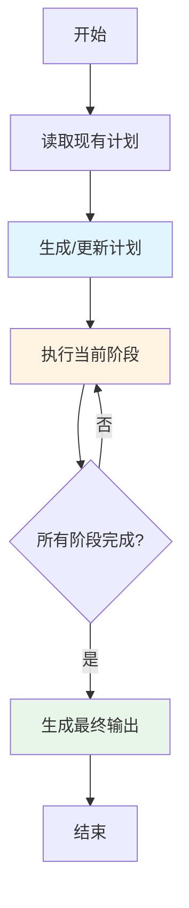

# ManusAgent

本文介绍了 **Manus 风格的规划代理**，它结合了 LangGraphGo 图执行引擎的强大功能和持久化 Markdown 文件规划能力。

## 背景：从 Manus AI 到 planning-with-files

### Manus AI 的成功故事

[Manus AI](https://www.manus.ai) 是一家被 Meta 于 2025 年 12 月以 **20 亿美元收购**的公司。在短短 8 个月内，Manus 从发布达到了 1 亿美元以上的收入。他们的成功秘诀是什么？**上下文工程（Context Engineering）**。

> "Markdown 是我在磁盘上的'工作记忆'。由于我迭代式处理信息且活动上下文有限，Markdown 文件作为笔记的草稿本、进度的检查点和最终交付物的构建块。"
> — [Manus AI](https://manus.im/zh-cn/blog/Context-Engineering-for-AI-Agents-Lessons-from-Building-Manus)

### planning-with-files：逆向工程的开源实现

[planning-with-files](https://github.com/OthmanAdi/planning-with-files) 是一个开源项目，由独立开发者 Ahmad Othman 创建，他**逆向工程**了 Manus AI 的核心工作流模式。

**故事背景：**

1. **Reddit 分析爆火** - Ahmad 在 Reddit 上发布了[详细分析](https://www.reddit.com/r/ClaudeAI/comments/1q2p03x/i_reverseengineered_the_workflow_that_made_manus/)，解释了 Manus 如何通过三文件模式突破 AI 上下文限制。帖子在 24 小时内获得大量关注，项目迅速走红, 短短一周项目的star数就超过了 3.4k。

2. **商业秘密变开源** - planning-with-files 将原本属于商业机密的工作流变成了开源的 Claude Code 技能，让任何人都能使用同样的技术。

3. **移植到 Go** -  我将相同的核心模式移植到 LangGraphGo，使 Go 开发者也能使用文件系统构建具备强大规划能力的 AI 应用。

### 本示例与 planning-with-files 的关系

| 特性 | planning-with-files | LangGraphGo Manus Agent |
|------|---------------------|-------------------------|
| **平台** | Claude Code 技能 | Go 程序库 |
| **集成方式** | Claude Code 插件 | 可编程 API |
| **用途** | 辅助 Claude 编程 | 构建 Go AI 应用 |
| **控制粒度** | 高级封装 | 完全可控 |

两者实现了**相同的核心模式**，但服务于不同的使用场景：
- 如果你想用 Claude Code 帮你编程 → 使用 **planning-with-files**
- 如果你想用 Go 构建自己的 AI 应用 → 使用 **LangGraphGo Manus Agent**

## 什么是 ManusAgent？

ManusAgent 实现了 Manus AI 的核心工作流模式，使用三个持久化 Markdown 文件来管理复杂任务：

- **task_plan.md** - 使用复选框跟踪工作流阶段
- **notes.md** - 存储研究发现和错误日志
- **output.md** - 生成最终交付物

### 三文件模式

Manus 的核心工作流使用三个持久化 Markdown 文件：

```
task_plan.md      → 跟踪阶段和进度
notes.md          → 存储研究和发现
[deliverable].md  → 最终输出
```

### 为什么需要这个模式？

传统的 AI 代理在处理复杂任务时往往会遇到一些棘手的问题。上下文窗口是有限的，当任务变得复杂时，重要信息很容易被淹没。更糟糕的是，某些代理甚至没有持久化存储，一旦上下文重置，所有进度都白费了。

具体来说：

- **易失性内存** — TodoWrite 这类工具在上下文重置后就消失了，毫无痕迹
- **目标漂移** — 经过 50+ 次工具调用后，代理常常忘了最初要干什么
- **隐藏错误** — 失败没有被记录下来，导致同样的错误一犯再犯
- **上下文填充** — 不论什么都往上下文里塞，而不是妥善存储

Manus 的三文件模式很好地解决了这些问题。通过将文件系统作为外脑，AI 可以突破上下文限制，保持目标清晰，并且所有工作都有据可查。

### 何时使用此模式

并不是所有任务都需要这么重的模式。简单的问题用简单的办法就好。

**✅ 适合这些场景：**

- 多步骤任务（3 个步骤以上）- 步骤多了就容易乱
- 研究任务 - 需要记录大量中间结果
- 构建/创建项目 - 有明确的阶段性目标
- 跨越多次工具调用的任务 - 上下文可能会断
- 任何需要组织的工作 - 没有组织就会混乱

**❌ 这些场景就算了：**

- 简单问题 - 一句话能解决的别折腾
- 单文件编辑 - 直接改更快
- 快速查询 - 查个资料用不上这么复杂的流程
  
### 工作循环

```
1. 创建 task_plan.md，包含目标和阶段
2. 研究 → 保存到 notes.md → 更新 task_plan.md
3. 读取 notes.md → 创建交付物 → 更新 task_plan.md
4. 交付最终输出
```

**关键洞察**：通过在每次决策前读取 `task_plan.md`，目标始终保持在注意力窗口中。这就是 Manus 如何处理约 50 次工具调用而不迷失方向的原因。

## 核心特性

这个实现继承了 Manus 工作流的核心优点：

✅ **持久化规划** - 计划不只是停留在内存里，而是保存到 Markdown 文件，随时可以查看和跟踪进度

✅ **自动检查点** - 每完成一个阶段就自动保存，下次可以从上次停止的地方继续，不用担心中断

✅ **错误日志** - 出错了不会丢失，所有错误都会自动记录到 notes.md，方便事后分析

✅ **人工可编辑** - 不喜欢某个阶段？直接编辑 task_plan.md 就能调整，不需要改代码

✅ **可视化进度** - 复选框一目了然，哪些完成了、哪些还待着，清清楚楚

## 工作原理



## 前置要求

开始之前，确保你的环境已经准备好了：

- Go 1.21 或更高版本 - 这个项目用了一些较新的 Go 特性
- OpenAI API 密钥 - 通过 `OPENAI_API_KEY` 环境变量设置。没有密钥的话示例跑不起来

## 安装

安装很简单，就两步：

```bash
cd examples/manus_agent
go mod tidy
```

`go mod tidy` 会自动下载所有需要的依赖。

## 运行示例

### 基本用法

```bash
# 设置你的 OpenAI API 密钥
export OPENAI_API_KEY="your-api-key-here"

# 可选：设置自定义模型或 API 基础地址
export OPENAI_MODEL="gpt-4"
export OPENAI_API_BASE="https://api.openai.com/v1"

# 运行示例
go run main.go
```

### 你将看到什么

代理会：

1. **创建工作目录** (`./manus_work/`)
2. **生成计划** 到 `task_plan.md`，带复选框
3. **执行每个阶段** (研究 → 编译 → 撰写 → 审核)
4. **更新复选框** 标记阶段完成
5. **记录发现** 到 `notes.md`
6. **生成最终输出** 到 `output.md`

### 示例输出

```
🚀 Manus Agent Example
=====================

Task: Research TypeScript benefits and write a summary

⏳ Executing Manus Agent...

🔍 Phase: Research
   - Searching for TypeScript documentation
   - Analyzing community feedback
   - Gathering statistical data

📝 Phase: Compile Findings
   - Organizing research data
   - Extracting key points
   - Creating structured notes

✍️  Phase: Write Summary
   - Drafting introduction
   - Writing body sections
   - Creating conclusion

✅ Phase: Review
   - Checking factual accuracy
   - Validating structure
   - Quality assessment

✅ Execution completed!
⏱️  Total time: 2.1s

📁 Generated Files:
==================

📄 task_plan.md:
---------------
%% Goal
Research and document the benefits of TypeScript for development teams

%% Phases
- [x] Phase 1: Research
  Description: Search for and gather information from external sources
  Node: research

- [x] Phase 2: Compile Findings
  Description: Compile findings into organized notes
  Node: compile

- [x] Phase 3: Write Summary
  Description: Write final deliverable based on research
  Node: write

- [x] Phase 4: Review
  Description: Review and validate the output
  Node: review

📋 output.md:
-----------
# Final Output

Generated at: 2025-01-07 15:30:45

[完整交付内容...]

💡 Tip: 编辑 task_plan.md 来调整工作流并重新运行！
```

## 生成的文件

### task_plan.md

包含工作流计划和进度复选框：

```markdown
%% Goal
Research and document the benefits of TypeScript for development teams

%% Phases
- [x] Phase 1: Research
  Description: Search for and gather information
  Node: research

- [ ] Phase 2: Compile
  Description: Compile findings into notes
  Node: compile
```

### notes.md

包含研究笔记和错误日志：

```markdown
## Research Notes

### TypeScript Benefits
- Type safety prevents runtime errors
- Better IDE support
- ...

## Error Log
[执行过程中遇到的任何错误]
```

### output.md

包含代理生成的最终交付物。

## 自定义

### 添加自定义阶段

编辑 `main.go` 中的 `nodes` 切片：

```go
nodes := []graph.TypedNode[map[string]any]{
    {
        Name:        "my_custom_phase",
        Description: "这个阶段做什么的描述",
        Function:    myCustomNodeFunc,
    },
    // ... 更多节点
}
```

### 修改文件路径

修改 `config`：

```go
config := prebuilt.ManusConfig{
    WorkDir:    "./my_work",
    PlanPath:   "./my_work/my_plan.md",
    NotesPath:  "./my_work/my_notes.md",
    OutputPath: "./my_work/my_output.md",
    AutoSave:   true,
    Verbose:    true,
}
```

### 人工干预

在阶段之间启用手动干预：

```go
agent.InterruptBefore([]string{"planner"})
```

然后在暂停时编辑 `task_plan.md`，代理恢复时会读取更新后的计划。

## 使用场景

Manus Agent 特别适合那些需要分步骤、有阶段性的任务。下面是一些典型场景：

✅ **多步骤研究** - 比如学术研究或市场分析，需要先收集资料、再整理、最后写报告

✅ **文档项目** - API 文档、用户指南这类有明确结构的文档，按章节一步步来更清晰

✅ **内容创作** - 写文章、报告、白皮书，先大纲再填充内容，最后润色

✅ **数据处理** - ETL 工作流、数据管道，每个环节都可以单独验证

✅ **复杂工作流** - 任何包含 3 个以上顺序步骤的任务，步骤越多越能体现优势

## 对比：Manus Agent vs Planning Agent

LangGraphGo 里还有一个 `CreatePlanningAgent`，它和 Manus Agent 有什么区别呢？

| 特性 | CreatePlanningAgent | CreateManusAgent |
|------|---------------------|------------------|
| 规划格式 | JSON | Markdown |
| 进度跟踪 | 消息历史 | 复选框 |
| 持久化 | 仅 State | 文件 + State |
| 人工编辑 | 通过 UpdateState() | 直接编辑文件 |
| 最适合 | 快速自动化 | 复杂多步骤任务 |

简单来说，如果你的任务比较简单、希望快速完成，用 `CreatePlanningAgent` 就够了。但如果任务复杂、需要人工干预、或者想要可视化进度，那么 `CreateManusAgent` 会更合适。

## 高级用法

### 从检查点恢复

不需要额外配置，代理会自动读取 `task_plan.md`，从上次待完成的阶段继续：

```go
result, err := agent.Invoke(ctx, initialState)
```

### 错误恢复

遇到错误时不用担心，所有错误都会自动记录到 `notes.md`：

```markdown
## Error [2025-01-07 15:30:45]
Error in phase 2 (compile): connection timeout
```

修复导致错误的问题后重新运行，代理会从失败阶段继续，不会重复已完成的工作。

### 动态规划

LLM 会根据你的具体请求动态生成计划。不同的目标会产生不同的计划结构：

```go
// 请求 1: "Research TypeScript benefits"
// → 计划: research → compile → write → review
// 四个阶段，比较全面

// 请求 2: "Quick TypeScript summary"
// → 计划: research → write
// 只要两个阶段，快速出结果
```

## 故障排除

遇到问题别慌，这里有一些常见问题的排查思路：

### 代理不创建文件

首先检查 `workDir` 路径是否正确，相对路径要注意是从哪里运行的。然后确认你有写入权限，最后看看 config 里 `AutoSave` 是否设置为 `true`。

### 计划生成失败

这通常和 LLM 有关。先检查你的 `OPENAI_API_KEY` 是否正确设置了。如果用的是 GPT-4，可以试试换成 `gpt-3.5-turbo`，便宜又快。另外，节点描述要尽量清晰，太模糊的话 LLM 可能不知道该怎么用。

### 阶段无法完成

这种情况要检查节点函数的返回值。确保返回了正确的 state，而且 state 里必须包含 `messages` 字段。如果还是搞不定，看看 `notes.md` 里有没有错误信息，那里有详细记录。

### 链接

- [原始 planning-with-files 项目](https://github.com/OthmanAdi/planning-with-files)
- [Manus AI 官网](https://www.manus.ai)
- [LangGraphGo 文档](https://github.com/smallnest/langgraphgo)
- [Meta 收购 Manus 新闻](https://www.theverge.com/2025/12/29/meta-acquires-manus-ai-2-billion-deal)
