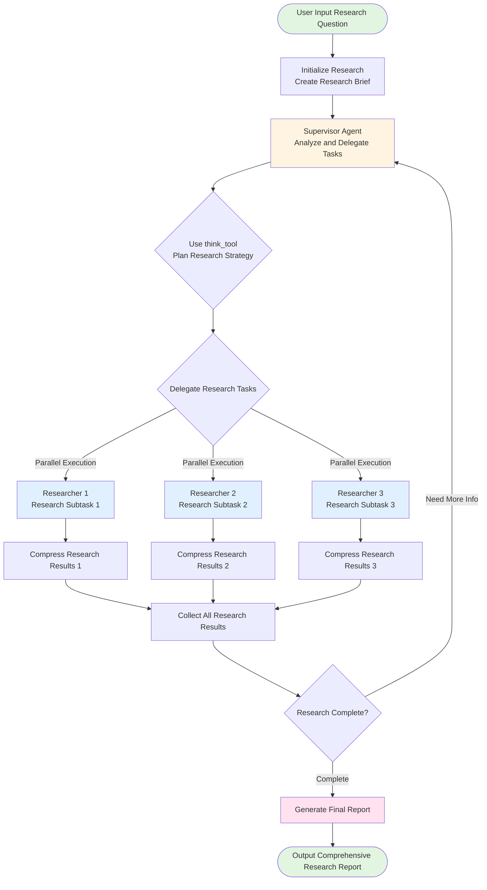
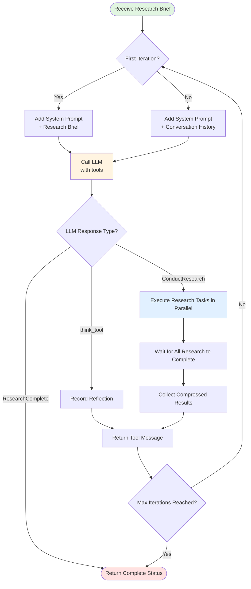
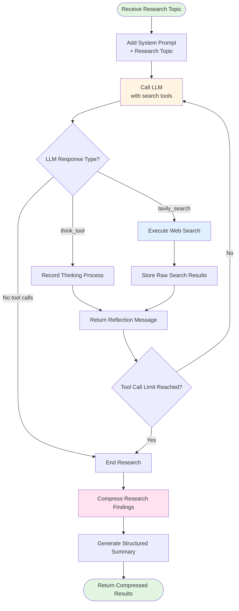
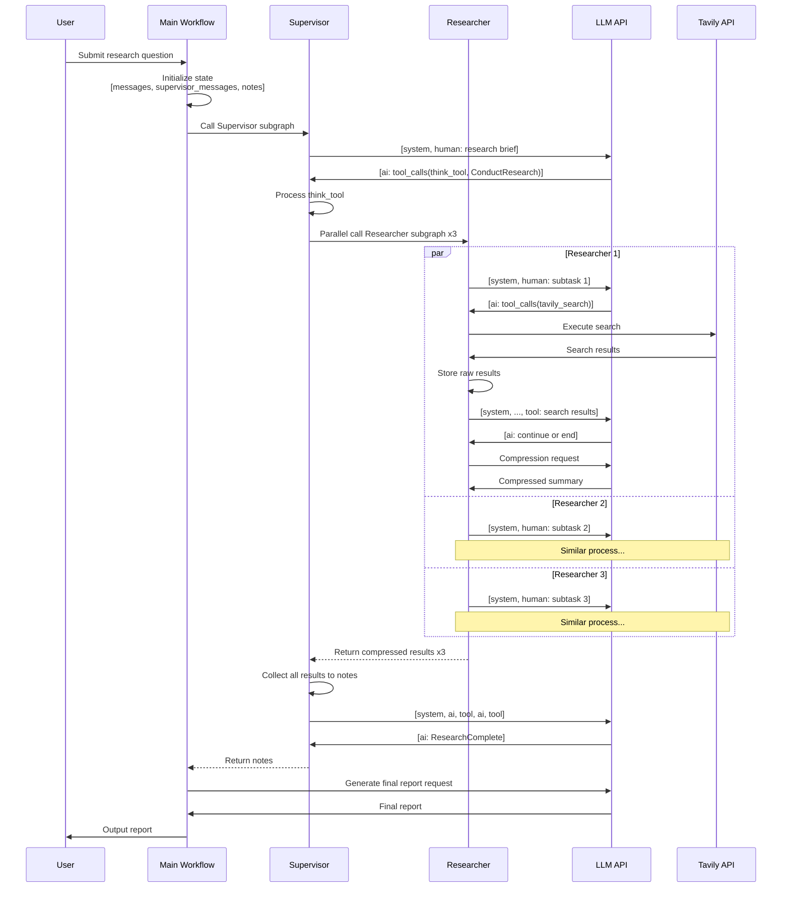

# Open Deep Research - Go Implementation

A Go implementation of the [langchain-ai/open_deep_research](https://github.com/langchain-ai/open_deep_research) multi-agent research system using the langgraphgo framework.

## Overview

This is a multi-agent deep research system that uses hierarchical workflows to conduct comprehensive research on complex topics. The system breaks down research questions into subtasks, delegates them to specialized researcher agents that work in parallel, and synthesizes findings into a comprehensive final report.

## Architecture

The system consists of three main components:

1. **Supervisor Agent**: Manages research delegation and coordinates multiple researcher agents
   - Analyzes the user's query
   - Breaks down complex questions into focused research subtasks
   - Delegates tasks to parallel researcher agents
   - Decides when research is complete

2. **Researcher Agents**: Execute focused research on specific topics
   - Use web search (Tavily API) to gather information
   - Employ reflection/thinking to plan search strategies
   - Compress and summarize findings
   - Work independently in parallel

3. **Report Generator**: Synthesizes all research findings into a final report
   - Combines findings from multiple researcher agents
   - Creates a well-structured, comprehensive report
   - Addresses the user's original question

## Features

- **Multi-agent coordination**: Supervisor delegates to multiple parallel researchers
- **Configurable models**: Support for different LLMs for different tasks
- **Iteration limits**: Prevents infinite loops and excessive API calls
- **Parallel execution**: Multiple researchers work simultaneously
- **Research compression**: Efficient summarization of findings
- **Comprehensive reporting**: Well-structured final reports

## Requirements

- Go 1.21 or higher
- OpenAI API key
- Tavily API key (for web search)

## Installation

```bash
# Clone the repository (or navigate to the showcase directory)
cd showcases/open_deep_research

# Set up environment variables
export OPENAI_API_KEY="your-openai-api-key"
export TAVILY_API_KEY="your-tavily-api-key"
```

## Usage

### Basic Usage

```bash
# Run with default query
go run *.go

# Run with custom query
go run *.go "Your research question here"
```

### Example

```bash
go run *.go "What are the latest advances in quantum computing and their practical applications?"
```

### Configuration

You can customize the behavior using environment variables:

```bash
# Model configuration
export RESEARCH_MODEL="deepseek-v3"              # Model for research agents
export FINAL_REPORT_MODEL="deepseek-v3"         # Model for final report
export COMPRESSION_MODEL="deepseek-v3"          # Model for compressing findings

# Research parameters
export MAX_RESEARCHER_ITERATIONS="10"       # Max supervisor iterations
export MAX_CONCURRENT_RESEARCH_UNITS="3"   # Max parallel researchers
export MAX_TOOL_CALL_ITERATIONS="20"       # Max tool calls per researcher
```

## How It Works

1. **Initialization**: Creates a research brief from the user's query
2. **Supervision**: Supervisor analyzes the brief and delegates research tasks
3. **Research**: Multiple researcher agents execute searches in parallel
4. **Compression**: Each researcher compresses their findings
5. **Synthesis**: All findings are combined into a final comprehensive report

## Detailed Workflow

### Overall Architecture Flow



### Supervisor Workflow Detailed



### Researcher Workflow Detailed



### State Management and Message Flow



### Data Flow Diagram

```mermaid
graph LR
    subgraph Input
        Q[User Query]
    end

    subgraph Initialization
        Q --> Brief[Research Brief]
        Brief --> State1[Initial State<br/>messages: []<br/>supervisor_messages: []<br/>notes: []]
    end

    subgraph Supervisor Loop
        State1 --> SM1[supervisor_messages<br/>+ AI message]
        SM1 --> SM2[supervisor_messages<br/>+ tool messages]
        SM2 --> Notes[notes<br/>+ research results]
    end

    subgraph Researcher Parallel
        SM1 -.delegate.-> R1State[Researcher 1<br/>messages: []]
        SM1 -.delegate.-> R2State[Researcher 2<br/>messages: []]
        SM1 -.delegate.-> R3State[Researcher 3<br/>messages: []]

        R1State --> R1Notes[raw_notes<br/>+ search results]
        R2State --> R2Notes[raw_notes<br/>+ search results]
        R3State --> R3Notes[raw_notes<br/>+ search results]

        R1Notes --> R1Comp[compressed_research]
        R2Notes --> R2Comp[compressed_research]
        R3Notes --> R3Comp[compressed_research]

        R1Comp -.return.-> SM2
        R2Comp -.return.-> SM2
        R3Comp -.return.-> SM2
    end

    subgraph Final Report
        Notes --> Findings[All Research Findings]
        Findings --> FinalReport[Final Report]
    end

    subgraph Output
        FinalReport --> Output[Comprehensive Research Report]
    end

    style Q fill:#e1f5e1
    style Output fill:#e1f5e1
    style SM1 fill:#fff4e1
    style R1Comp fill:#e1f0ff
    style R2Comp fill:#e1f0ff
    style R3Comp fill:#e1f0ff
    style FinalReport fill:#ffe1f0
```

## Key Concepts

### 1. State Accumulation
- Uses `AppendReducer` to accumulate message history
- Messages returned by each node are appended to state
- Maintains complete conversation context

### 2. Message Sequence
Correct message ordering is crucial:
```
[system] -> [human] -> [ai with tool_calls] -> [tool responses] -> [ai] -> ...
```

### 3. Parallel Execution
- Supervisor uses goroutines to parallelize multiple Researchers
- Uses channels to collect results
- Limits maximum concurrent units

### 4. Iteration Control
- Supervisor: `MAX_RESEARCHER_ITERATIONS` (default 10)
- Researcher: `MAX_TOOL_CALL_ITERATIONS` (default 20)
- Prevents infinite loops

### 5. Subgraph Integration
- Both Supervisor and Researcher are independent subgraphs
- Each subgraph has its own schema and reducers
- Main graph coordinates subgraph execution

## Example Output

```
=== Open Deep Research ===
Research Model: deepseek-v3
Final Report Model: deepseek-v3
Max Researcher Iterations: 10
Max Concurrent Research Units: 3

Research Query: What are the latest advances in large language models in 2024?

Starting research process...
---
[Supervisor] Delegating research tasks...
[Researcher 1] Searching for: model architectures
[Researcher 2] Searching for: reasoning capabilities
[Researcher 3] Searching for: efficiency improvements
[Final Report] Generating comprehensive report...

================================================================================
RESEARCH COMPLETE
================================================================================

[Final report content here...]

Metadata:
- Research iterations: 3
- Research findings collected: 3
- Raw search results: 15
- Final report length: 2847 characters
```

## Comparison with Python Implementation

This Go implementation follows the same architecture as the original Python version:

| Feature | Python | Go |
|---------|--------|-------|
| Multi-agent coordination | ✅ | ✅ |
| Parallel researcher execution | ✅ | ✅ |
| Configurable models | ✅ | ✅ |
| Tavily search integration | ✅ | ✅ |
| Iteration limits | ✅ | ✅ |
| Research compression | ✅ | ✅ |

## Project Structure

```
open_deep_research/
├── config.go           # Configuration management
├── state.go            # State definitions and structures
├── prompts.go          # System prompts for agents
├── utils.go            # Utility functions and tools
├── researcher.go       # Researcher subgraph implementation
├── supervisor.go       # Supervisor subgraph implementation
├── deep_researcher.go  # Main workflow integration
├── main.go             # Example application
└── README.md           # This file
```

## Troubleshooting

### API Key Errors

```
Error: OPENAI_API_KEY not set
```
Make sure you have set the required environment variables.

### Rate Limiting

If you encounter rate limiting errors, you can:
- Reduce `MAX_CONCURRENT_RESEARCH_UNITS`
- Reduce `MAX_RESEARCHER_ITERATIONS`
- Use different model tiers

### Empty Reports

If the final report is empty or inadequate:
- Check that Tavily API key is valid
- Verify the query is clear and specific
- Increase iteration limits if needed

## License

This implementation follows the same license as the langgraphgo project.

## References

- [Original Python Implementation](https://github.com/langchain-ai/open_deep_research)
- [LangGraph Documentation](https://python.langchain.com/docs/langgraph)
- [Tavily Search API](https://www.tavily.com/)
