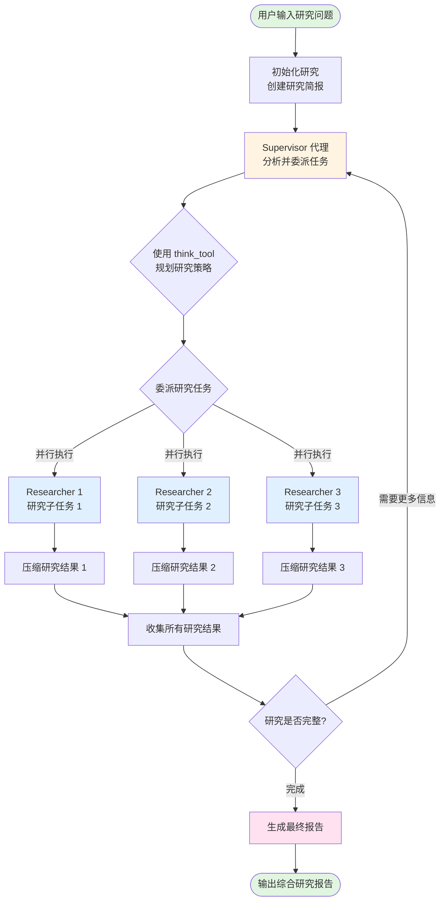
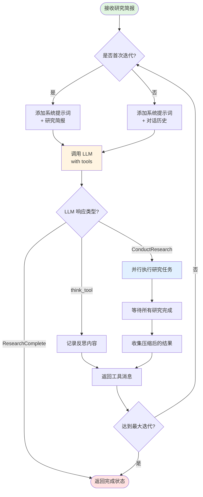
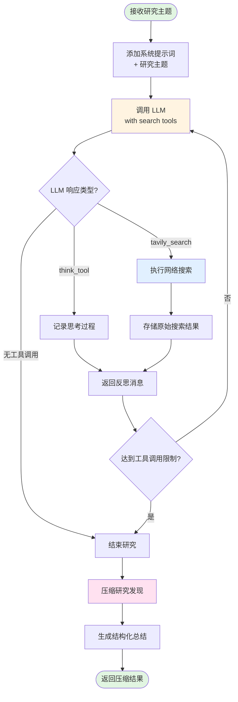
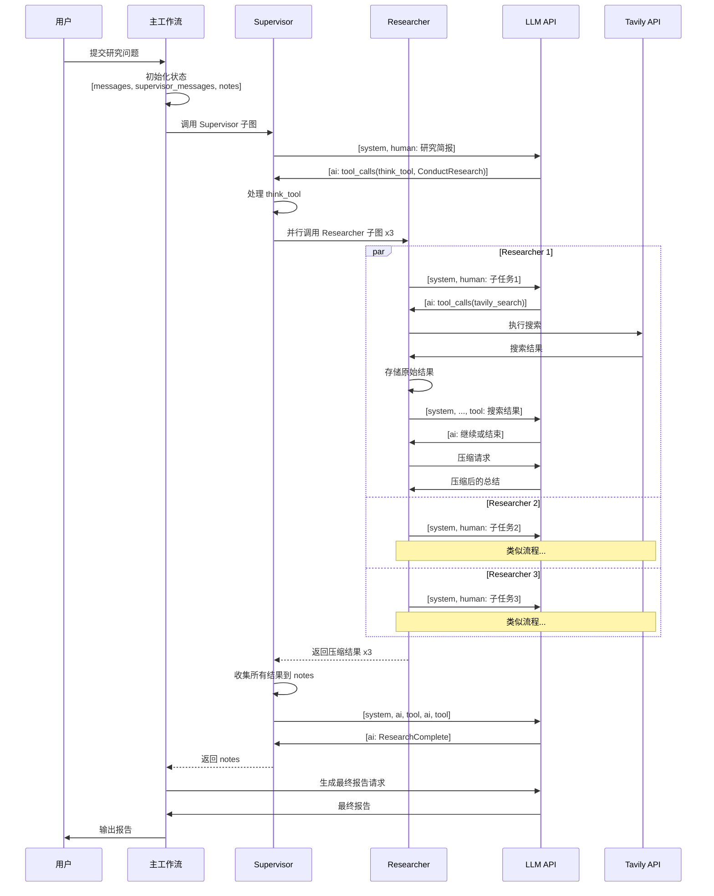

# Open Deep Research - Go 实现

基于 langgraphgo 框架的 [langchain-ai/open_deep_research](https://github.com/langchain-ai/open_deep_research) 多代理研究系统的 Go 语言实现。

## 概述

这是一个多代理深度研究系统，使用分层工作流对复杂主题进行全面研究。系统将研究问题分解为子任务，委派给并行工作的专业研究代理，并将研究结果综合成全面的最终报告。

## 架构

系统由三个主要组件组成：

1. **Supervisor 代理**：管理研究委派并协调多个研究代理
   - 分析用户查询
   - 将复杂问题分解为聚焦的研究子任务
   - 将任务委派给并行研究代理
   - 决定何时完成研究

2. **Researcher 代理**：对特定主题执行聚焦研究
   - 使用网络搜索（Tavily API）收集信息
   - 采用反思/思考来规划搜索策略
   - 压缩和总结研究发现
   - 独立并行工作

3. **报告生成器**：将所有研究发现综合成最终报告
   - 合并来自多个研究代理的发现
   - 创建结构良好、全面的报告
   - 回答用户的原始问题

## 特性

- **多代理协调**：Supervisor 委派给多个并行研究者
- **可配置模型**：支持不同任务使用不同的 LLM
- **迭代限制**：防止无限循环和过度 API 调用
- **并行执行**：多个研究者同时工作
- **研究压缩**：高效总结研究发现
- **全面报告**：结构良好的最终报告

## 系统要求

- Go 1.21 或更高版本
- OpenAI API 密钥
- Tavily API 密钥（用于网络搜索）

## 安装

```bash
# 克隆仓库（或导航到 showcase 目录）
cd showcases/open_deep_research

# 设置环境变量
export OPENAI_API_KEY="your-openai-api-key"
export TAVILY_API_KEY="your-tavily-api-key"
```

## 使用方法

### 基本用法

```bash
# 使用默认查询运行
go run *.go

# 使用自定义查询运行
go run *.go "你的研究问题"
```

### 示例

```bash
go run *.go "量子计算的最新进展及其实际应用有哪些？"
```

### 配置

可以使用环境变量自定义行为：

```bash
# 模型配置
export RESEARCH_MODEL="deepseek-v3"              # 研究代理使用的模型
export FINAL_REPORT_MODEL="deepseek-v3"         # 最终报告使用的模型
export COMPRESSION_MODEL="deepseek-v3"          # 压缩发现使用的模型

# 研究参数
export MAX_RESEARCHER_ITERATIONS="10"       # Supervisor 最大迭代次数
export MAX_CONCURRENT_RESEARCH_UNITS="3"   # 最大并行研究者数量
export MAX_TOOL_CALL_ITERATIONS="20"       # 每个研究者的最大工具调用次数
```

## 工作原理

1. **初始化**：从用户查询创建研究简报
2. **监督**：Supervisor 分析简报并委派研究任务
3. **研究**：多个研究代理并行执行搜索
4. **压缩**：每个研究者压缩其发现
5. **综合**：将所有发现合并成最终综合报告

## 详细工作流程

### 整体架构流程



### Supervisor 工作流详细流程



### Researcher 工作流详细流程



### 状态管理和消息流



### 数据流图

```mermaid
graph LR
    subgraph 输入
        Q[用户查询]
    end

    subgraph 初始化
        Q --> Brief[研究简报]
        Brief --> State1[初始状态<br/>messages: []<br/>supervisor_messages: []<br/>notes: []]
    end

    subgraph Supervisor循环
        State1 --> SM1[supervisor_messages<br/>+ AI message]
        SM1 --> SM2[supervisor_messages<br/>+ tool messages]
        SM2 --> Notes[notes<br/>+ 研究结果]
    end

    subgraph Researcher并行
        SM1 -.委派.-> R1State[Researcher 1<br/>messages: []]
        SM1 -.委派.-> R2State[Researcher 2<br/>messages: []]
        SM1 -.委派.-> R3State[Researcher 3<br/>messages: []]

        R1State --> R1Notes[raw_notes<br/>+ 搜索结果]
        R2State --> R2Notes[raw_notes<br/>+ 搜索结果]
        R3State --> R3Notes[raw_notes<br/>+ 搜索结果]

        R1Notes --> R1Comp[compressed_research]
        R2Notes --> R2Comp[compressed_research]
        R3Notes --> R3Comp[compressed_research]

        R1Comp -.返回.-> SM2
        R2Comp -.返回.-> SM2
        R3Comp -.返回.-> SM2
    end

    subgraph 最终报告
        Notes --> Findings[所有研究发现]
        Findings --> FinalReport[最终报告]
    end

    subgraph 输出
        FinalReport --> Output[综合研究报告]
    end

    style Q fill:#e1f5e1
    style Output fill:#e1f5e1
    style SM1 fill:#fff4e1
    style R1Comp fill:#e1f0ff
    style R2Comp fill:#e1f0ff
    style R3Comp fill:#e1f0ff
    style FinalReport fill:#ffe1f0
```

## 关键概念

### 1. 状态累积
- 使用 `AppendReducer` 累积消息历史
- 每个节点返回的消息会追加到状态中
- 保持完整的对话上下文

### 2. 消息序列
正确的消息顺序至关重要：
```
[system] -> [human] -> [ai with tool_calls] -> [tool responses] -> [ai] -> ...
```

### 3. 并行执行
- Supervisor 使用 goroutines 并行调用多个 Researcher
- 使用 channels 收集结果
- 限制最大并发数量

### 4. 迭代控制
- Supervisor: `MAX_RESEARCHER_ITERATIONS` (默认 10)
- Researcher: `MAX_TOOL_CALL_ITERATIONS` (默认 20)
- 防止无限循环

### 5. 子图集成
- Supervisor 和 Researcher 都是独立的子图
- 每个子图有自己的 schema 和 reducers
- 主图协调子图的执行

## 输出示例

```
=== Open Deep Research ===
Research Model: deepseek-v3
Final Report Model: deepseek-v3
Max Researcher Iterations: 10
Max Concurrent Research Units: 3

Research Query: 2024年大语言模型的最新进展有哪些？

Starting research process...
---
[Supervisor] 委派研究任务中...
[Researcher 1] 搜索：模型架构
[Researcher 2] 搜索：推理能力
[Researcher 3] 搜索：效率改进
[Final Report] 生成综合报告中...

================================================================================
研究完成
================================================================================

[最终报告内容...]

元数据：
- 研究迭代次数：3
- 收集的研究发现：3
- 原始搜索结果：15
- 最终报告长度：2847 字符
```

## 与 Python 实现的对比

此 Go 实现遵循与原始 Python 版本相同的架构：

| 功能 | Python | Go |
|------|--------|-----|
| 多代理协调 | ✅ | ✅ |
| 并行研究者执行 | ✅ | ✅ |
| 可配置模型 | ✅ | ✅ |
| Tavily 搜索集成 | ✅ | ✅ |
| 迭代限制 | ✅ | ✅ |
| 研究压缩 | ✅ | ✅ |

## 项目结构

```
open_deep_research/
├── config.go           # 配置管理
├── state.go            # 状态定义和结构
├── prompts.go          # 代理的系统提示词
├── utils.go            # 工具函数和辅助工具
├── researcher.go       # Researcher 子图实现
├── supervisor.go       # Supervisor 子图实现
├── deep_researcher.go  # 主工作流集成
├── main.go             # 示例应用程序
├── README.md           # 英文文档
└── README_CN.md        # 本文件（中文文档）
```

## 故障排除

### API 密钥错误

```
Error: OPENAI_API_KEY not set
```
确保已设置所需的环境变量。

### 速率限制

如果遇到速率限制错误，可以：
- 减少 `MAX_CONCURRENT_RESEARCH_UNITS`
- 减少 `MAX_RESEARCHER_ITERATIONS`
- 使用不同的模型层级

### 空报告

如果最终报告为空或不充分：
- 检查 Tavily API 密钥是否有效
- 验证查询是否清晰具体
- 如需要可增加迭代限制

## 许可证

此实现遵循 langgraphgo 项目的相同许可证。

## 参考资料

- [原始 Python 实现](https://github.com/langchain-ai/open_deep_research)
- [LangGraph 文档](https://python.langchain.com/docs/langgraph)
- [Tavily 搜索 API](https://www.tavily.com/)
- [LangGraphGo 项目](https://github.com/smallnest/langgraphgo)

## 贡献

欢迎提交问题和拉取请求！

## 致谢

感谢 LangChain 团队开发了原始的 open_deep_research 项目，为多代理研究系统提供了优秀的架构设计。
